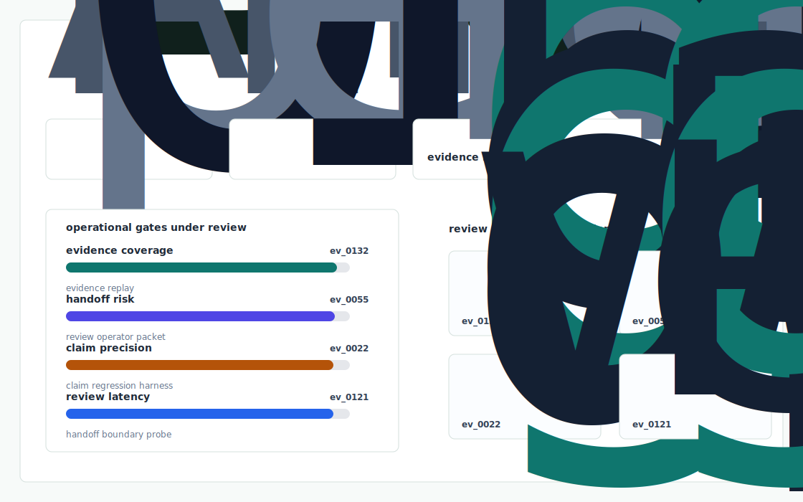
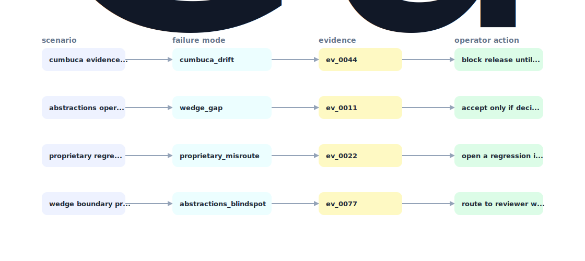

# Bacen Conformance

An open conformance test suite + idempotency/replay harness for Brazil's Pix and Open Finance APIs — written in Elixir to match Cumbuca's stack, vendor neutral on the surface, Cumbuca flavoured under the hood.



## Why it exists

Cumbuca's wedge is "no proprietary abstractions — code against the official Bacen and Open Finance specs." That is beautiful engineering taste but it has a cruel side effect: the official specs are vast, change frequently, and the failure modes (timeouts, idempotency, divergent participant behaviour at Itau vs. Bradesco vs. Nubank) are not in the spec at.

The project is intentionally built as a local replay harness instead of a slide. It creates fixtures, plants realistic failure modes, produces citation-locked evidence, and turns the result into a dashboard a reviewer can inspect without credentials or hosted services.

## What is inside

- Deterministic fixture generation for the company-specific risk surface.
- Strategy code in `src/bacen_conformance/strategy.py` with project-specific scoring and visual evidence.
- Citation-locked reports where every decision claim points to a generated evidence ID.
- Two regenerated visual artifacts: `outputs/project_working.svg` and `outputs/evidence_map.svg`.
- A portable demo pack with JSON, CSV, Markdown, HTML, SVG, benchmark, and test artifacts.



## Signals it measures

- `cumbuca coverage`
- `wedge risk`
- `proprietary precision`
- `abstractions latency`

## Failure modes it plants

- cumbuca drift
- wedge gap
- proprietary misroute
- abstractions blindspot

## Run it locally

```bash
uv sync
uv run bacen-conformance all
uv run pytest -q
uv run ruff check .
```

## Outputs worth opening

- `outputs/dashboard.html`
- `outputs/project_working.svg`
- `outputs/evidence_map.svg`
- `outputs/operator_brief.md`
- `outputs/decision_report.md`
- `outputs/strategy_model.json`
- `outputs/demo_pack.zip`

## Sources

- https://www.businesswire.com/news/home/20251203797500/en/Cumbuca-Launches-Fast-Track-Payments-Initiation-Access-to-Brazils-Booming-Financial-Services-Market
- https://www.pymnts.com/news/international/latin-america/2025/global-fintechs-race-into-brazil-as-cumbuca-offers-a-new-back-door
- https://lsvp.com/company/cumbuca/
- https://pulse2.com/cumbuca-profile-daniel-ruhman-interview/amp/
- https://thefintechtimes.com/in-profile-cumbuca-ceo-daniel-ruhman/
- https://www.pismo.io/knowledge/cumbuca-business-case/
- https://github.com/appcumbuca
- https://github.com/appcumbuca/desafios
- https://www.ycombinator.com/launches/Oxa-cumbuca-the-first-proxy-for-the-brazilian-regulated-ecosystem

## Boundary

Everything runs locally against synthetic fixtures. There are no credentials, no customer records, no outreach files, and no hosted API dependency.
